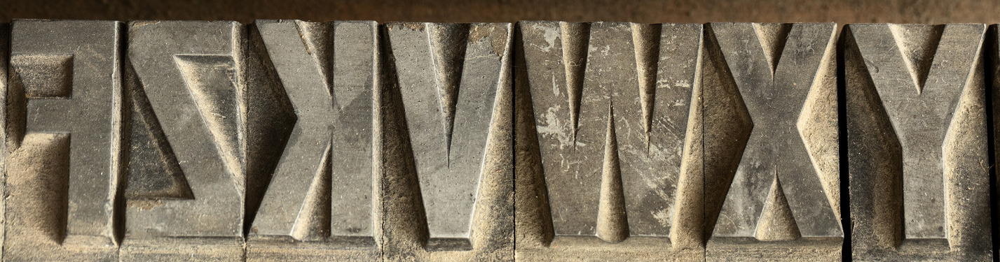
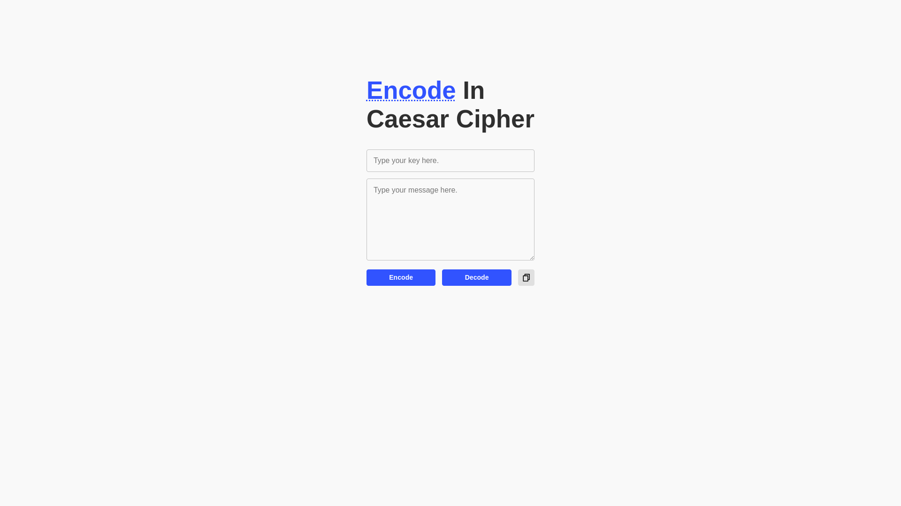

<h1 align="center">
    Caesar Cipher
</h1>

    Website created as a challenge in a cryptography teaching project!

  

## Content Table

- [Description](#description)
- [Preview](#preview)
- [Screenshot](#screenshot)
- [License](#license)
- [Contact](#contact)

## Description

This Caesar cipher website was created as a self-challenge when I was participating in a teaching project about cryptography.

## Preview

🔗 [Caesar Cipher - Preview](https://victor101106.github.io/Caesar-Cipher/)

## Screenshot

## License

Distributed under the MIT license. See [LICENSE](LICENSE.md) for more information.

## Contact

Victor Gabriel • [Github](https://github.com/Victor101106/) • victorgabriel101106+github@gmail.com
